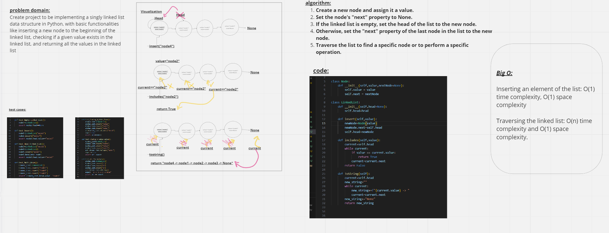

# Code Challenge: Class 05: Linked List Implementation



# Approach & Efficiency
**insert method:** This method has a time complexity of O(1) since it simply creates a new node and updates the head attribute of the linked list. The space complexity is also O(1) since only one new node is created.

**includes method:** This method has a time complexity of O(n) in the worst case, where n is the number of nodes in the linked list. This is because we need to traverse the entire linked list to check whether a given value exists in it. The space complexity is O(1) since we only use a few variables to keep track of the current node and the result.

**ToString method:** This method has a time complexity of O(n) in the worst case, since we need to traverse the entire linked list to construct the string representation. The space complexity is O(n) since we create a new string object that contains all the values in the linked list.


# Solution
python Python/code_challenge05/New_Implementation/New_Implementation.py

```
if __name__ == "__main__":
    node1=Node("node1")
    print(node1)
    node2=LinkedList("node2")
    node2.insert("node1")
    print(node2.insert("node3"))
    print(node2.includes("node1"))
```


