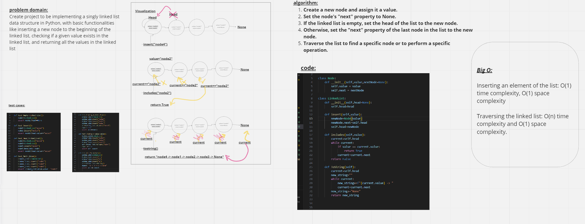
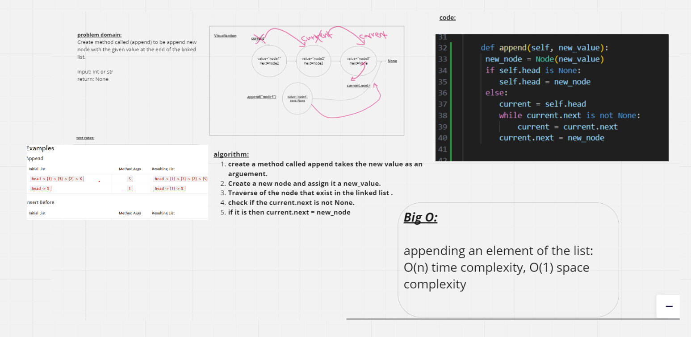
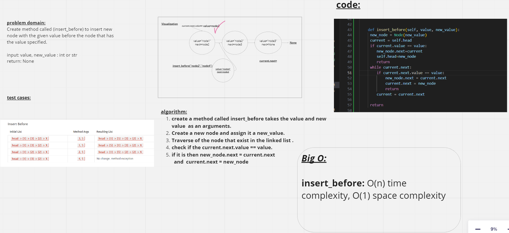
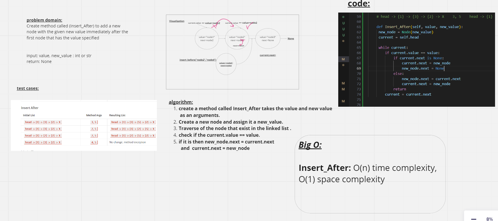
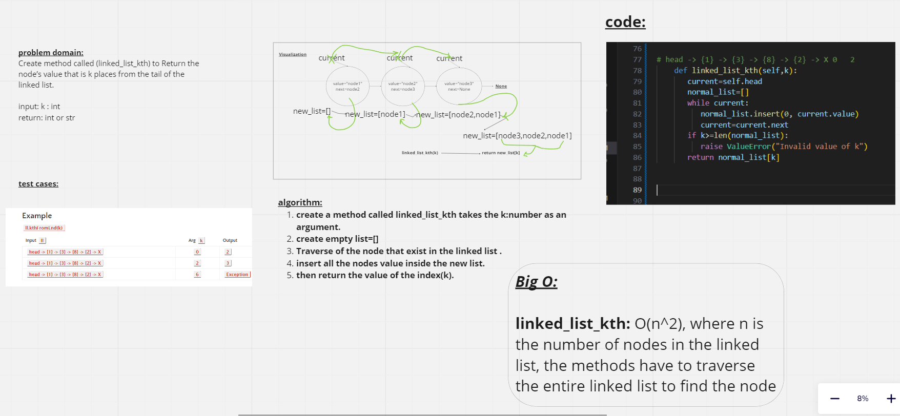

# Code Challenge: Class 05: Linked List Implementation & Class 06 & class 08








# Approach & Efficiency
**insert method:** This method has a time complexity of O(1) since it simply creates a new node and updates the head attribute of the linked list. The space complexity is also O(1) since only one new node is created.

**includes method:** This method has a time complexity of O(n) in the worst case, where n is the number of nodes in the linked list. This is because we need to traverse the entire linked list to check whether a given value exists in it. The space complexity is O(1) since we only use a few variables to keep track of the current node and the result.

**ToString method:** This method has a time complexity of O(n) in the worst case, since we need to traverse the entire linked list to construct the string representation. The space complexity is O(n) since we create a new string object that contains all the values in the linked list.

**append method** is O(n), where n is the number of nodes in the linked list. This is because the method has to traverse the entire linked list to find the last node, so the time it takes to execute grows linearly with the size of the input. The space complexity is also O(1) since only one new node is created.

**insert_before and Insert_After** methods is O(n), where n is the number of nodes in the linked list. This is because in the worst case, the methods have to traverse the entire linked list to find the node with the specified value, so the time it takes to execute grows linearly with the size of the input. The space complexity is also O(1) since only one new node is created.

**linked_list_kth** methods is O(n^2), where n is the number of nodes in the linked list, the methods have to traverse the entire linked list to find the node with the specified value, and isert the value in the first index of the normal_list. The space complexity is also O(n) since new list is created.

**linked_list_zip** The time complexity of the linked_list_zip function is O(n),where n is the total number of nodes in both input linked lists.This is because the function traverses each node in the two lists exactly once while creating the merged list.
The space complexity of the linked_list_zip function is O(n), because it creates a new empty list to store the merged node 
from two linked list.

# Solution
python Python/code_challenge05/New_Implementation/New_Implementation.py

```python
if __name__ == "__main__":
    node1=Node("node1")
    print(node1.value)
    node2=Node("node2",node1)
    print(node2.value)
    LinkedList1=LinkedList(node2)
    print(LinkedList1.head.value)
    LinkedList1.insert("node")
    LinkedList1.insert("node1")
    LinkedList1.insert("node2")
    LinkedList1.ToString()
    LinkedList1.includes("node3")
    node3=LinkedList()
    print(node3.append("node4"))
    print(node3.insert_before("node2","node4"))
    print(LinkedList1.linked_list_kth(1))
```

/////////////////**Code Challenge: Class 08**//////////////////

```python
def linked_list_zip(self,LL1=None, LL2=None):
        merged_list=[]

        pointer1 = LL1.head
        pointer2 = LL2.head

        while  pointer1 and  pointer2:
            merged_list.append( pointer1.value)
            merged_list.append( pointer2.value)
            pointer1= pointer1.next
            pointer2= pointer2.next

        if pointer1 is not None:
           merged_list.append(pointer1.value)

        if pointer2 is not None:
           merged_list.append(pointer2.value)
           
        if LL1.head is None :
           return LL2
        if LL2.head is None :
           return LL1
        
               
        merged_list.append(None)
        return merged_list

```


