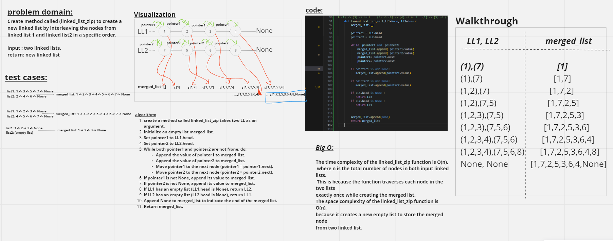

# Code Challenge:class 08




# Approach & Efficiency

**linked_list_zip** The time complexity of the linked_list_zip function is O(n),where n is the total number of nodes in both input linked lists.This is because the function traverses each node in the two lists exactly once while creating the merged list.
The space complexity of the linked_list_zip function is O(n), because it creates a new empty list to store the merged node 
from two linked list.


# Solution
python Python/code_challenge08/linked_list_zip/linked_list_zip.py 

```python
def linked_list_zip(LL1=None, LL2=None):
    merged_list = LinkedList()

    pointer1 = LL1.head
    pointer2 = LL2.head

    while pointer1 and pointer2:
        merged_list.append(pointer1.value)
        merged_list.append(pointer2.value)
        pointer1 = pointer1.next
        pointer2 = pointer2.next

    if pointer1 is not None:
        merged_list.append(pointer1.value)

    if pointer2 is not None:
        merged_list.append(pointer2.value)

    if LL1.head is None:
        return LL2

    if LL2.head is None:
        return LL1

    return merged_list
```