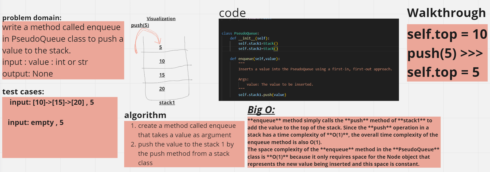
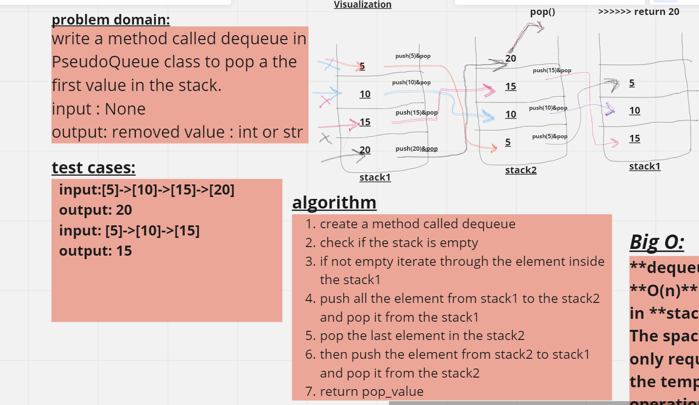
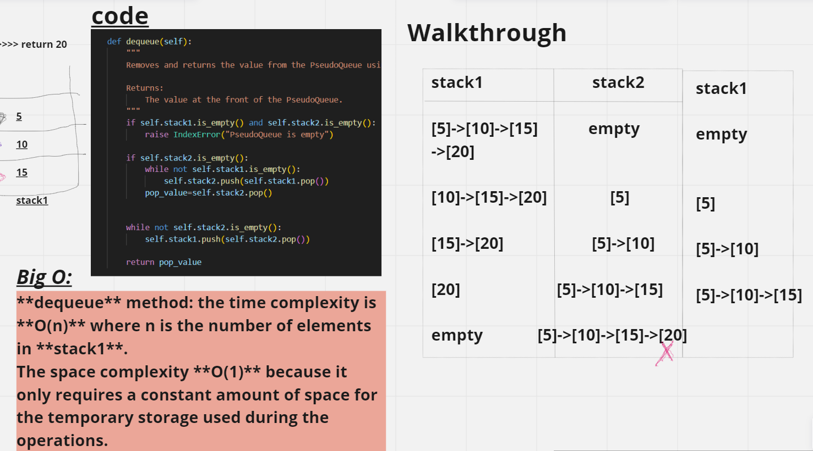

# Code Challenge: Class 11
# pseudo queue

//////// inqueue whiteboard /////////


//////// denqueue whiteboard /////////



## Approach & Efficiency

**enqueue** method simply calls the **push** method of **stack1** to add the value to the top of the stack. Since the **push** operation in a stack has a time complexity of **O(1)**, the overall time complexity of the enqueue method is also O(1).
The space complexity of the **enqueue** method in the **PseudoQueue** class is **O(1)** because it only requires space for the Node object that represents the new value being inserted and this space is constant.

**dequeue** method: the time complexity is **O(n)** where n is the number of elements in **stack1**.
The space complexity **O(1)** because it only requires a constant amount of space for the temporary storage used during the operations.


## Solution
python Python/code_challenge11/pseudo_queue.py

```python
if __name__ == "__main__":
    queue = PseudoQueue()
    # queue.enqueue(5)   #### if stack1 is empty ####
    # print(queue.stack1.peek())
    queue.enqueue(20)
    queue.enqueue(15)
    queue.enqueue(10)
    queue.enqueue(5)
    print(queue.stack1.peek())

    output = queue.dequeue()
    print(output)
```