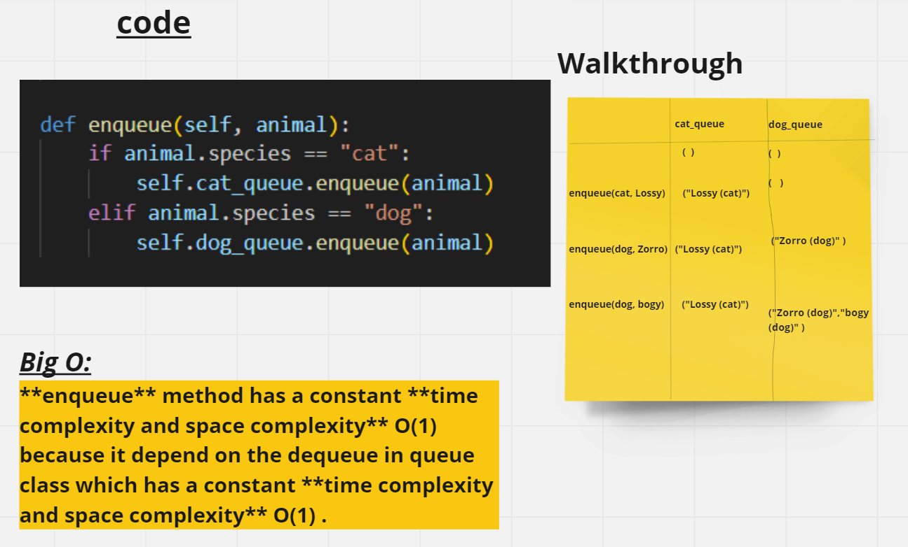

# Code Challenge: Class 12
# stack-queue-animal-shelter

# //////// inqueue whiteboard /////////



# //////// denqueue whiteboard /////////

.png)

## Approach & Efficiency

**enqueue** method has a time complexity of O(1) because it only appends an animal to the end of a list.
The space complixcity is O(1) because it does not depend on the number of animals already in the shelter.

**dequeue** method can be considered O(n), where n is the number of animals in the list.
The space complixcity is O(n), because all the animals after the removed animal need to be shifted to fill the empty space.

## Solution
python Python/code_challenge12/stack_queue_animal_shelter/stack_queue_animal_shelter.py

```python
if __name__ == "__main__":
    shelter = AnimalShelter()
    cat1=Animal("cat","LoLo")
    shelter.enqueue(cat1)
    dog1=Animal("dog","zoro")
    shelter.enqueue(dog1)
    cat2=Animal("cat","losy")
    shelter.enqueue(cat2)
    dog2=Animal("dog","bogy")
    shelter.enqueue(dog2)
    shelter.print_animals()
    print("///////////////////////////")
    shelter.dequeue("cat")
    shelter.dequeue("cat")
    shelter.print_animals()
```