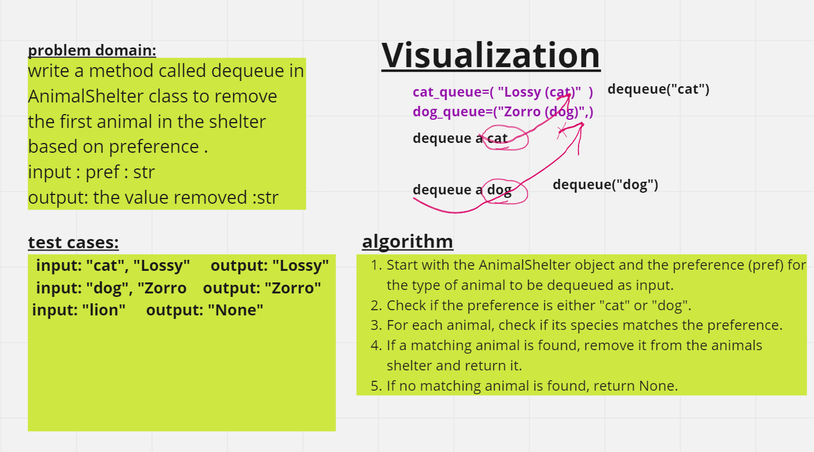

# Code Challenge: Class 12
# stack-queue-animal-shelter

# //////// inqueue whiteboard /////////


# //////// denqueue whiteboard /////////

.png)

## Approach & Efficiency

**enqueue** method has a constant **time complexity and space complexity** O(1) because it depend on the dequeue in queue class which has a constant **time complexity and space complexity** O(1) .

**dequeue** method has a constant **time complexity and space complexity** O(1) beecause it depend on the enqueue in queue class which has a constant **time complexity and space complexity** O(1) .

## Solution
python Python/code_challenge12/stack_queue_animal_shelter/stack_queue_animal_shelter.py

```python
if __name__ == "__main__":
    shelter = AnimalShelter()
    cat1=Animal("cat","LoLo")
    shelter.enqueue(cat1)
    dog1=Animal("dog","zorro")
    shelter.enqueue(dog1)
    cat2=Animal("cat","lossy")
    shelter.enqueue(cat2)
    dog2=Animal("dog","bogy")
    shelter.enqueue(dog2)
    print("///////////////////////////")
    pref = "cat"
    dequeued_animal = shelter.dequeue(pref)
    print(dequeued_animal.name)
    pref = "dog"
    dequeued_animal = shelter.dequeue(pref)
    print(dequeued_animal.name)
```