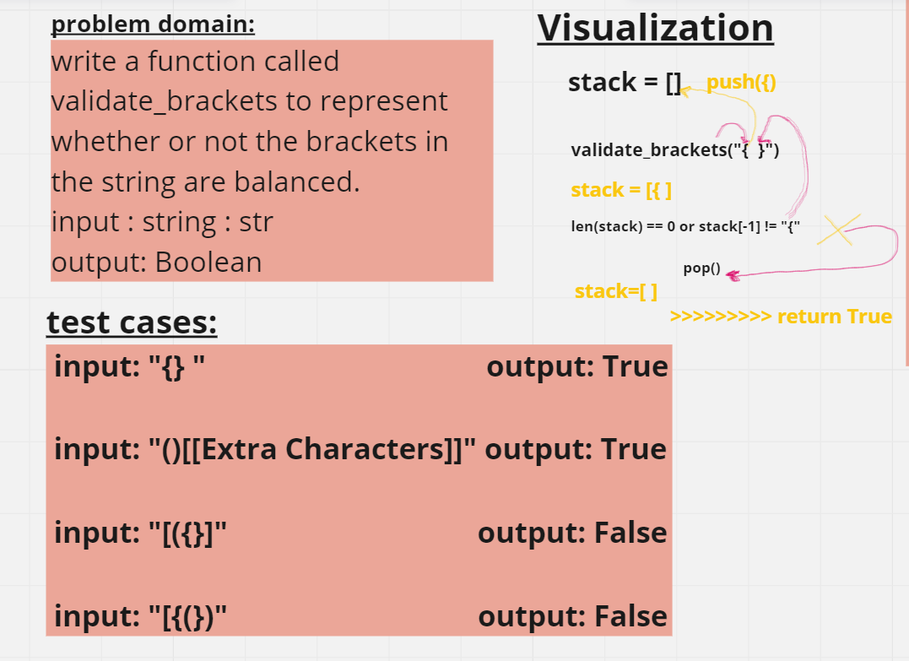
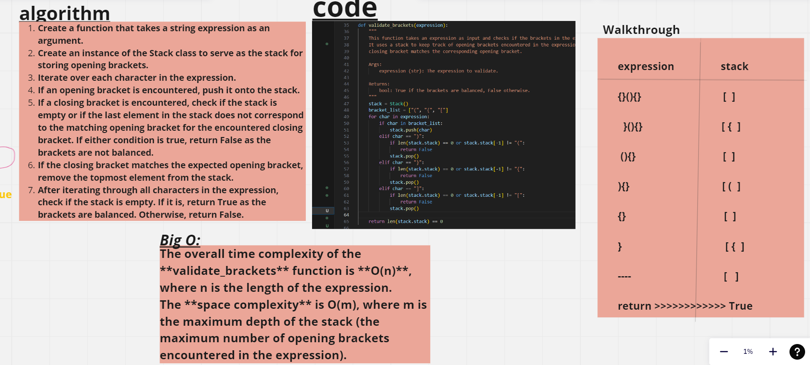
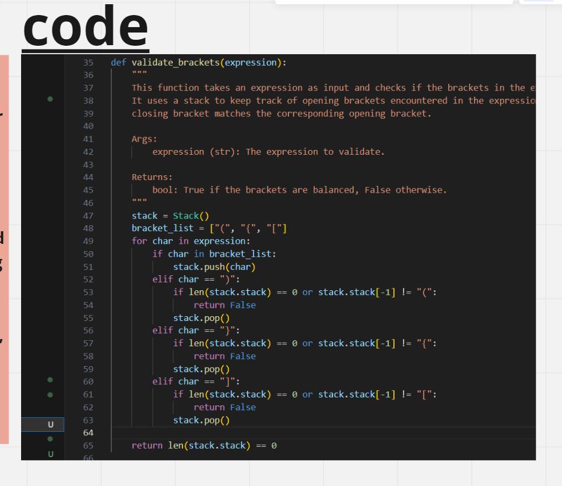

# Code Challenge: Class 13
# stack-queue-brackets






## Approach & Efficiency

The overall time complexity of the **validate_brackets** function is **O(n)**, where n is the length of the expression.
The **space complexity** is O(m), where m is the maximum depth of the stack (the maximum number of opening brackets encountered in the expression).


## Solution
python Python/code_challenge13/stack_queue_brackets/stack_queue_brackets.py

```python
if __name__ == "__main__":
    print(validate_brackets("{(})"))
    print(validate_brackets("{}{Code}[Fellows](())"))
```