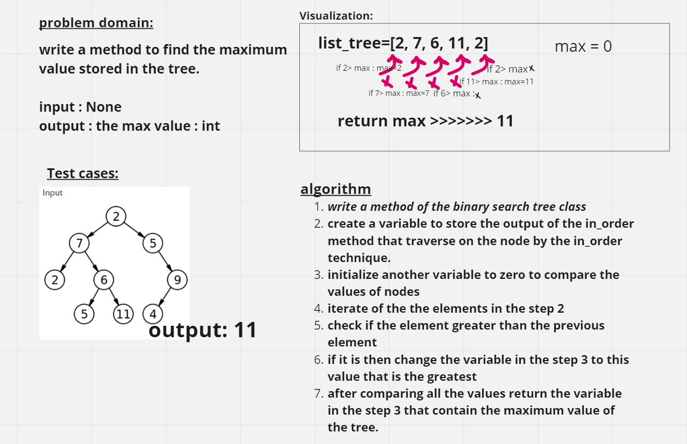
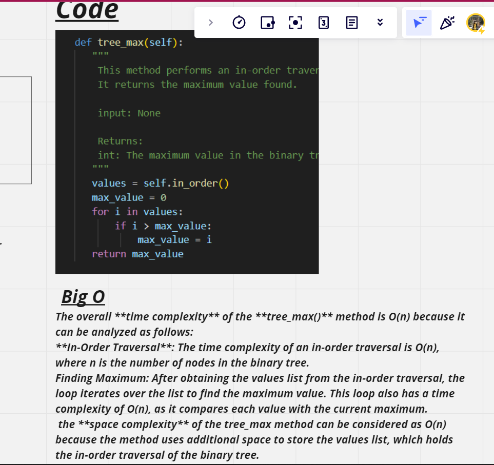

# Code Challenge: Class 16
# Tree_max



## Approach & Efficiency


The overall **time complexity** of the **tree_max()** method is O(n) because it can be analyzed as follows:
**In-Order Traversal**: The time complexity of an in-order traversal is O(n), where n is the number of nodes in the binary tree. 

Finding Maximum: After obtaining the values list from the in-order traversal, the loop iterates over the list to find the maximum value. This loop also has a time complexity of O(n), as it compares each value with the current maximum.

the **space complexity** of the tree_max method can be considered as O(n) because the method uses additional space to store the values list, which holds the in-order traversal of the binary tree.

## Solution
python Python/code_challenge16/tree_max/tree_max.py  

```python
if __name__ == "__main__":
    binary_tree=BStTree()
    binary_tree.root=TNode(2)
    binary_tree.root.left=TNode(7)
    binary_tree.root.right=TNode(5)
    binary_tree.root.left.left=TNode(2)
    binary_tree.root.left.right=TNode(6)
    binary_tree.root.left.right.right=TNode(11)
    binary_tree.root.right.right=TNode(9)
    binary_tree.root.right.right.left=TNode(4)
    print(binary_tree.tree_max())
```