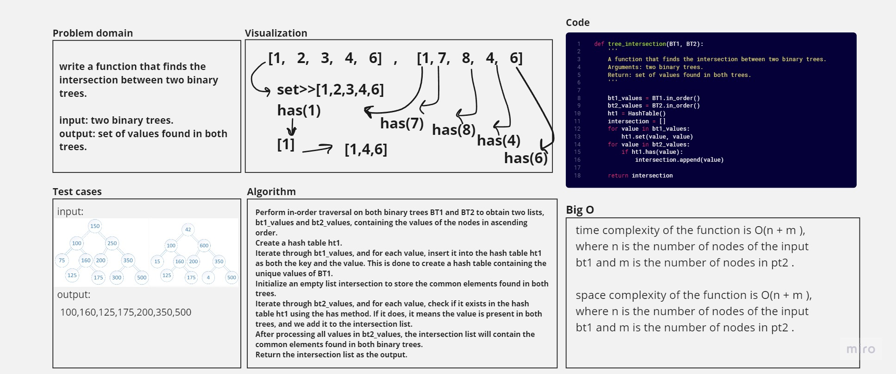

# Code Challenge: Class 32
# tree_intersection

## Whiteboard Process


## Approach & Efficiency
time complexity of the function is O(n + m ), where n is the number of nodes of the input bt1 and m is the number of nodes in pt2 .
space complexity of the function is O(n + m ), where n is the number of nodes of the input bt1 and m is the number of nodes in pt2 .


## Solution

python Python/code_challenge32/tree_intersection/tree_intersection.py

```python
if __name__ == "__main__":
    # Create BinaryTree 1
    BT1 = BinaryTree()
    BT1.root = TreeNode(150)
    BT1.root.left = TreeNode(100)
    BT1.root.right = TreeNode(250)
    BT1.root.left.left = TreeNode(75)
    BT1.root.left.right = TreeNode(160)
    BT1.root.left.right.left = TreeNode(125)
    BT1.root.left.right.right = TreeNode(175)
    BT1.root.right.left = TreeNode(200)
    BT1.root.right.right = TreeNode(350)
    BT1.root.right.right.left = TreeNode(300)
    BT1.root.right.right.right = TreeNode(500)


    # Create BinaryTree 2
    BT2 = BinaryTree()
    BT2.root = TreeNode(42)
    BT2.root.left = TreeNode(100)
    BT2.root.right = TreeNode(600)
    BT2.root.left.left = TreeNode(15)
    BT2.root.left.right = TreeNode(160)
    BT2.root.left.right.left = TreeNode(125)
    BT2.root.left.right.right = TreeNode(175)
    BT2.root.right.left = TreeNode(200)
    BT2.root.right.right = TreeNode(350)
    BT2.root.right.right.left = TreeNode(4)
    BT2.root.right.right.right = TreeNode(500)
    intersection_set = tree_intersection(BT1, BT2)
    print("Common elements found in both trees:", intersection_set)

```