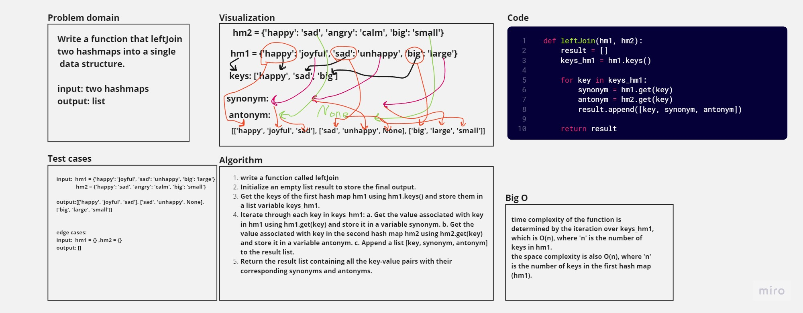

# Code Challenge: Class 33
# hashmap-left-join

## Whiteboard Process


## Approach & Efficiency
time complexity of the function is determined by the iteration over keys_hm1, which is O(n), where 'n' is the number of keys in hm1.
the space complexity is also O(n), where 'n' is the number of keys in the first hash map (hm1).


## Solution

python Python/code_challenge33/hashmap_left_join/hashmap_left_join.py

```python
if __name__=="__main__":
    hm1 = HashTable()
    hm1.set("happy", "joyful")
    hm1.set("sad", "unhappy")
    hm1.set("big", "large")

    hm2 = HashTable()
    hm2.set("happy", "sad")
    hm2.set("angry", "calm")
    hm2.set("big", "small")
    result = leftJoin(hm1, hm2)
    print(result)

```