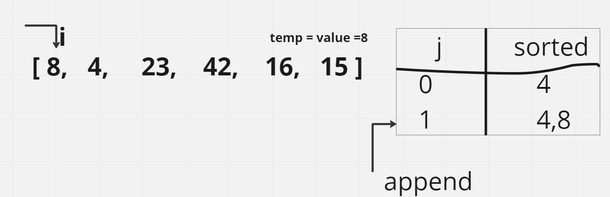
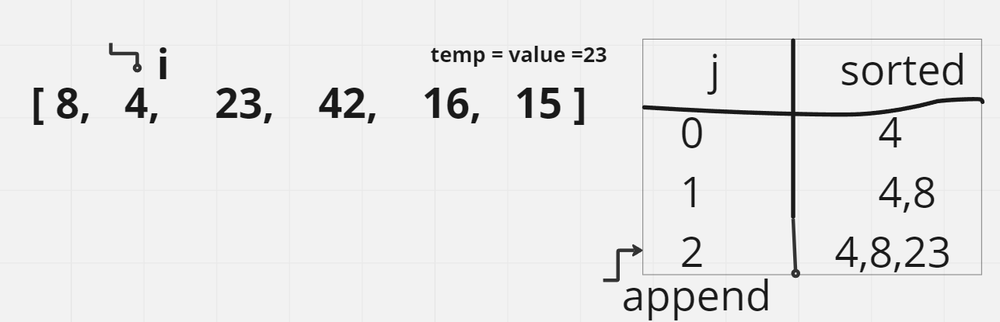
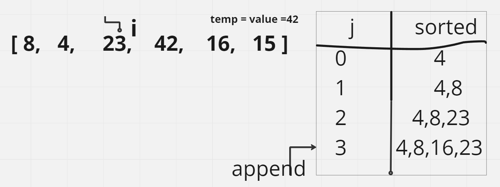
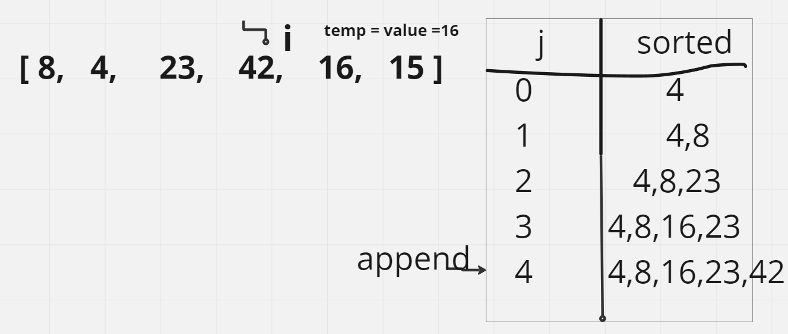
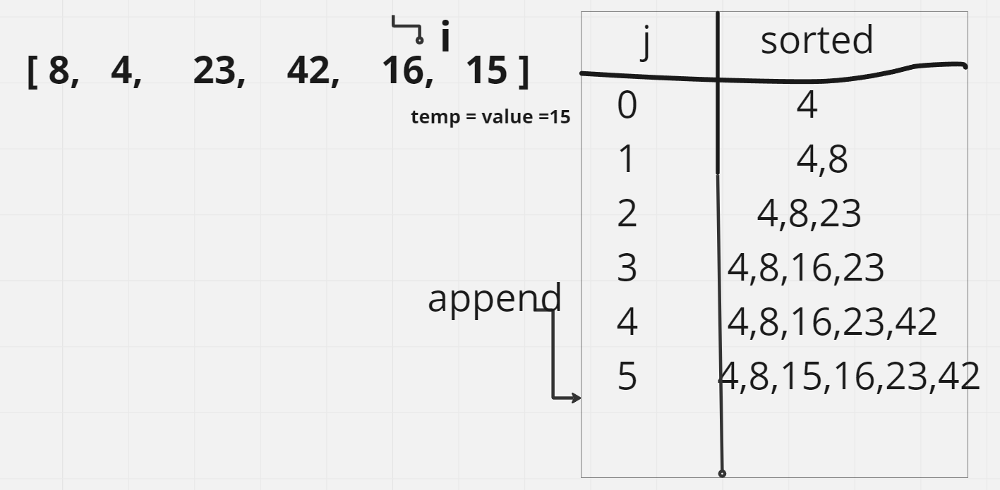
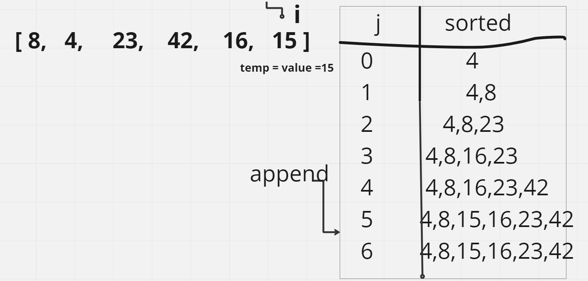

## Insertion Sort

**Insertion Sort is a sorting algorithm that iterates through the array, gradually building the sorted sequence. It compares each element with the already sorted portion of the array and inserts it at the appropriate position to maintain the sorted order. In each iteration, the algorithm selects an element and finds its correct position by shifting the larger elements to the right. This process is repeated until the entire array is sorted.**

Pseudocode
```
Insert(int[] sorted, int value)
  initialize i to 0
  WHILE value > sorted[i]
    set i to i + 1
  WHILE i < sorted.length
    set temp to sorted[i]
    set sorted[i] to value
    set value to temp
    set i to i + 1
  append value to sorted

InsertionSort(int[] input)
  LET sorted = New Empty Array
  sorted[0] = input[0]
  FOR i from 1 up to input.length
    Insert(sorted, input[i])
  return sorted
```
**Trace**
Sample Array: [8,4,23,42,16,15]

**Pass 1:**

Pass 1 of Insertion Sort


In the first pass of the insertion sort, the array is initially [8, 4, 23, 42, 16, 15]. The first element, 8, is considered sorted. The algorithm then compares the second element, 4, with the sorted portion of the array. Since 4 is smaller than 8, it is moved to the left, resulting in 
[4, 8, 23, 42, 16, 15].

**Pass 2:**

Pass 2 of Insertion Sort

In the second pass, the array is [4, 8, 23, 42, 16, 15]. The second element, 8, is already in the correct position relative to the sorted portion [4]. Therefore, no swapping is needed.

**Pass 3:**

Pass 3 of Insertion Sort

In the third pass, the array is [4, 8, 23, 42, 16, 15]. The third element, 23, is greater than 8, so it remains in its position.

**Pass 4:**

Pass 4 of Insertion Sort

In the fourth pass, the array is [4, 8, 23, 42, 16, 15]. The fourth element, 42, is greater than 23, so it remains in its position.

**Pass 5:**

Pass 5 of Insertion Sort

In the fifth pass, the array is [4, 8, 23, 42, 16, 15]. The fifth element, 16, is smaller than 42. It is compared with each element in the sorted portion [4, 8, 23, 42] and shifted to the left until it reaches its correct position. The resulting array becomes [4, 8, 16, 23, 42, 15].

**Pass 6:**

Pass 6 of Insertion Sort

In the sixth pass, the array is [4, 8, 16, 23, 42, 15]. The sixth element, 15, is smaller than 42. It is compared with each element in the sorted portion [4, 8, 16, 23, 42] and shifted to the left until it reaches its correct position. The resulting array becomes [4, 8, 15, 16, 23, 42].

After the final pass, the array [4, 8, 15, 16, 23, 42] is sorted, and the algorithm terminates.

**Efficiency**
Time: O(n^2)
The time complexity of the Insertion Sort algorithm is O(n^2) in the worst case and average case. This is because in each pass, the algorithm compares the selected element with each element in the sorted portion of the array, resulting in nested loops. As the size of the array increases, the number of comparisons and swaps grows quadratically.

Space: O(1)
The space complexity of the Insertion Sort algorithm is O(1) because it performs sorting in-place. It does not require any additional data structures or allocate memory proportional to the input size. The sorting is done by shifting elements within the array itself, keeping the space complexity constant.