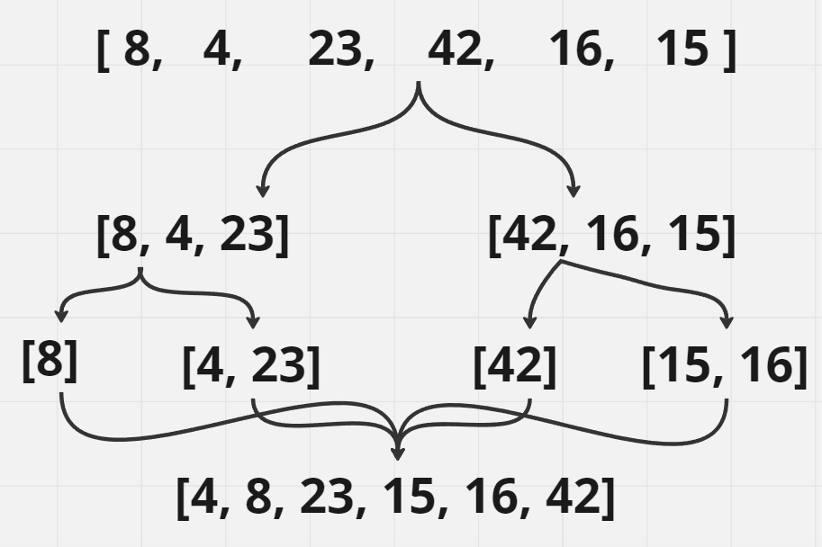
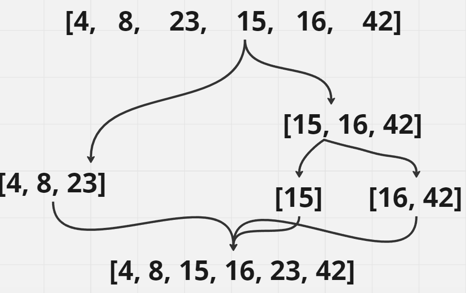

# Comparisons
**The comparator function takes a and b, and returns a number less than zero if a should come before b when sorting is completed. There are two approaches for numbers to implement such a function. The first uses the < operator, and by convention returns -1 if a < b. If a > b, it returns 1, and if a == b, it returns 0. While the contract of the comparator function says any number is a valid return so long as the less-than-0 rule holds, by convention we return -1, 0, or 1.**

Pseudocode
```
function compareNumbers(a, b) {
  if (a == b) return 0;
  if (a < b) return -1;
  if (a > b) return 1;
}
```
**Trace**
**Sample Array: [8, 4, 23, 42, 16, 15]**

**Pass 1:**

Pass 1 of Merge Sort


In the first pass of the Merge Sort algorithm, the array is initially [8, 4, 23, 42, 16, 15]. The array is divided into two halves: [8, 4, 23] and [42, 16, 15]. Each half is recursively sorted using the Merge Sort algorithm.

For the left half [8, 4, 23], it further divides into [8] and [4, 23]. Since [8] and [4, 23] have only one element each, they are considered sorted.

For the right half [42, 16, 15], it further divides into [42] and [16, 15]. Similarly, [42] and [16, 15] are considered sorted.

The sorted halves [8] and [4, 23] from the left side, and [42] and [15, 16] from the right side are merged together. During the merging process, the elements are compared and placed in the correct order. The resulting array becomes [4, 8, 23, 15, 16, 42].

**Pass 2:**

Pass 2 of Merge Sort


In the second pass of the Merge Sort algorithm, the array [4, 8, 23, 15, 16, 42] is divided into two halves: [4, 8, 23] and [15, 16, 42]. Each half is recursively sorted using the Merge Sort algorithm.

For the left half [4, 8, 23], it is already sorted and does not require further division.

For the right half [15, 16, 42], it further divides into [15] and [16, 42]. Since [15] and [16, 42] have only one element each, they are considered sorted.

The sorted halves [4, 8, 23] and [15, 16, 42] are merged together. During the merging process, the elements are compared and placed in the correct order. The resulting array becomes [4, 8, 15, 16, 23, 42].

After the final pass, the array [4, 8, 15, 16, 23, 42] is completely sorted, and the algorithm terminates.

**Efficiency**
Time: O(n log n)
The time complexity of the Merge Sort algorithm is O(n log n) in all cases. The array is divided into halves recursively until each subarray has only one element, which takes O(log n) time. Then, during the merging process, the elements are compared and placed in the correct order, which takes O(n) time. As a result, the total time complexity is O(n log n).

**Space: O(n)**
The space complexity of the Merge Sort algorithm is O(n) because it requires additional space to store the merged subarrays during the merging process. The size of this additional space is proportional to the size of the input array.